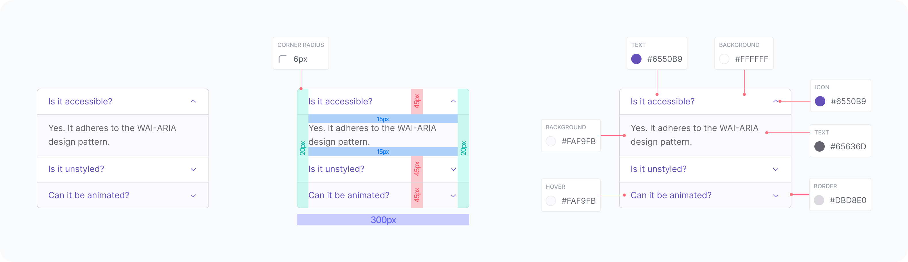

## Frontend Code Challenge: Accordion Component

### Objective:
Create a React `Accordion` component allowing the user to open and close items at will.<br />


Image URL in case the image is not displayed: https://snipboard.io/GQvyFr.jpg

### Requirements:
- It should use a declarative UI to render the accordion items.
  - Example of a declarative UI:
    ```
    <Accordion>
      <AccordionItem title="Is it accessible?" />
      <AccordionItem defaultExpanded title="Is it unstyled?" />
      <AccordionItem title="Can it be animated?" />
    <Accordion />
    ```
- It should be possible to specify which accordion item should be opened by default.
- Only one accordion item should be open at a time. Clicking on a closed item should open it, and clicking on an open item should close it.

### Constraints:
- Use React for building the component.
- Use TypeScript for creating the necessary types.
- Implement a clean and readable code structure.
- Write unit tests for the `Accordion` component using Jest.
- The design will be evaluated based on the provided image.

### Evaluation Criteria:
- Functionality: Does the `Accordion` component work as expected?
- Code Quality: Is the code clean, readable, and well-organized?
- Component Design: Is the component designed with reusability and maintainability in mind?
- Testing: Are there comprehensive Jest tests for the `Accordion` component?
- Design: Does the `Accordion` component match the provided image?

### Time Allotment:
- 50 minutes for implementing the `Accordion` component.
- 30 minutes for writing Jest tests.
- 20 minutes for discussing the solution and answering questions.
- 1 hour and 40 minutes as the total time allotment.

### FAQ:
- Can I use the internet to search for solutions?
  - Yes, you can use any resources available to you.
- Can I use AI such as GitHub Copilot?
  - Yes, you can use any resources available to you.
- Can I use third-party libraries?
  - Yes, you can use third-party libraries.
- Can I use more time for the implementation and less time for the tests or vice versa?
  - Yes, you can use the time as you see fit, but remember that the total time allotment for the implementation and testing is 1 hour and 20 minutes.
- I need more time to complete the challenge. Can I have an extension?
  - No, the time allotment is part of the challenge. You'll at most have 2 hours to complete the challenge.

Good luck!
